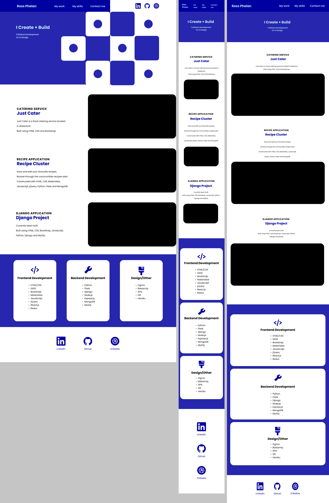

# My Portfolio

This is my portfolio page I built. Here I can display the projects I build at my time at The Code Institute along with other projects I have added.

# Technologies

## Languages :

- HTML/CSS

## Frameworks :

- Sass

## Design :

- Figma

# UX UI

## Colours :

- I choose to use blue as the primary and secondary colours within my project based upon personal preference of blue being my favourite colour. My colours of my text are black and white, with blue been used for clickable links and icons.

## Fonts :

- I used the front "Poppins" for the project.

## Icons :

- I added my social accounts and used icons to link the accounts. Icons are also used for my skill set section to represent the area of topic.

## Designs :

- In Figma, I created a random abstract image for my page.

## Mockups :

- I created my mockups in Figma. I designed for desktop, mobile and tablet. Some designs may slightly differ from the finished project.

# Layout & Features

- The navbar has clickable links to parts of the page including : My work, My skills and Contact me. It also has links to three of my social accounts : LinkedIn, GitHub and Dribbble.

- Underneath the navbar is my intro and title. Beside this is an image I made.

- The project section has a heading what the application, is followed by the name of the project. Beneath is a description. Alongside is an image of the project, which is also clickable to be directed to the project.

- Within my skill section it is broken into 3 rows : Frontend, Backend and Other. Each row has an icon followed by the heading of the skill and the technologies used beneath.

* At the end of the webpage are my social accounts : LinkedIn, GitHub, Dribbble. Some of which don't show on mobile or tablet view in the navbar.

# Testing

- I tested my project by adding media queries for different viewing devices.

- All links have been tested to ensure they are directed to the right places.

# Credits

I used the following references for my project.

- [YouTube](https://www.youtube.com/watch?v=9iUJJHEIpls) I watched a video of Gary Simons making a portfolio and also teaching more about mockups. This video taught me a lot about UX UI. I have included some of his concepts in my design.

- [Stack Overflow](https://stackoverflow.com/) Researched various topics and threads I needed advice on.

- [ColorDrop](https://colordrop.io/popular/) I got my colour template from here.

- [Google Fonts](https://fonts.google.com/) Where I got my font.
